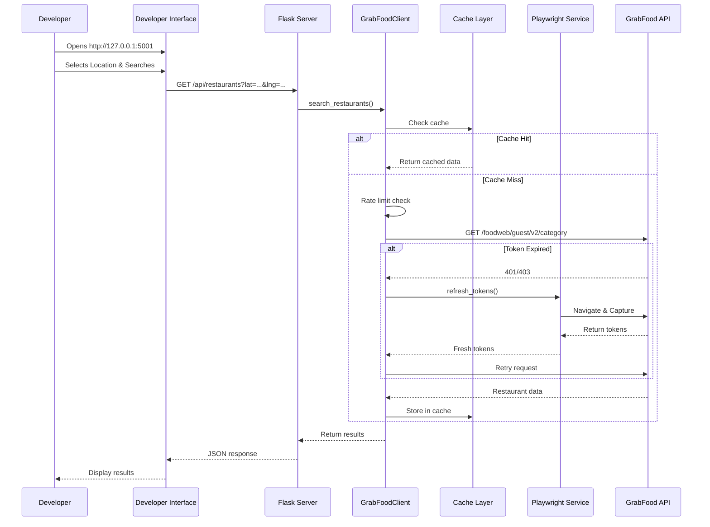

# GrabFood API Wrapper - Developer Interface

> **⚠️ IMPORTANT: This is NOT an official GrabFood API or port.** This project is a reverse-engineered wrapper for educational and development purposes. Use responsibly and respect Grab's terms of service.

A Python-based API wrapper and developer interface for GrabFood. This project reverse-engineers the GrabFood web API to allow programmatic access to restaurant data using latitude and longitude coordinates.

## ❓ Why?

GrabFood **does not provide a public API** for developers. This makes it difficult to build custom integrations, data analysis tools, or alternative frontends. This project works around these limitations by reverse-engineering the web client's behavior, allowing you to programmatically search for restaurants and data without official support.

## 🚀 Features

### Core Functionality
- **Automated Token Capture**: Bypasses bot detection to retrieve session tokens using Playwright
- **Restaurant Search**: Fetches nearby restaurants via the Guest Category Endpoint (`guest/v2/category`) to avoid strict `x-recaptcha-token` requirements
- **Local Filtering**: Implements keyword filtering (e.g., "Pizza") on the client-side since the guest endpoint only lists categories
- **Developer-Focused UI**: Modern interface with API testing, request logs, and documentation

### Advanced Features
- **Token Expiry Detection**: Automatically detects expired tokens and triggers refresh
- **Intelligent Caching**: In-memory cache with configurable TTL (default: 5 minutes) to reduce API calls
- **Rate Limiting**: Built-in rate limiting with a minimum interval of 500 ms to prevent overwhelming servers
- **User-Agent Rotation**: Random user agent selection to reduce detection risk
- **Background Token Refresh**: Automatic token refresh every hour with error recovery
- **Request Logging**: Track all API requests with timing and response data
- **Error Handling**: Comprehensive error handling with detailed error messages

## 📡 API Reference

### `GET /api/restaurants`

Search for restaurants near a specific location.

**Parameters:**
- `lat` (float, required): Latitude of the location (-90 to 90)
- `lng` (float, required): Longitude of the location (-180 to 180)
- `keyword` (string, optional): Search keyword to filter results (e.g., "pizza", "kfc"). Defaults to "food"
- `limit` (int, optional): Maximum number of results (1-100). Defaults to 32
- `use_cache` (bool, optional): Use cached results if available. Defaults to true

**Example Request:**
```bash
curl "http://localhost:5001/api/restaurants?lat=3.140853&lng=101.693207&keyword=pizza&limit=20"
```

**Response:**
```json
{
  "restaurants": [
    {
      "id": "1-C2...",
      "name": "McDonald's - Ipoh",
      "latitude": 3.140853,
      "longitude": 101.693207,
      "cuisine": ["Burgers", "Fast Food"],
      "rating": 4.8,
      "distance": 1.2,
      "price": 2,
      "status": "OPENED",
      "photo": "https://food-cms.grab.com/...",
      "link": "https://food.grab.com/my/en/restaurant/mcdonalds-ipoh-delivery/1-C2..."
    }
  ],
  "count": 1
}
```

**Price Levels:**
- `1` = $ (Cheap)
- `2` = $$ (Moderate)
- `3` = $$$ (Expensive)

### `POST /api/refresh-token`

Manually refresh authentication tokens using Playwright. This endpoint launches a headless browser to capture fresh tokens.

**Request Body:**
```json
{
  "lat": 3.140853,
  "lng": 101.693207
}
```

**Example Request:**
```bash
curl -X POST "http://localhost:5001/api/refresh-token" \
  -H "Content-Type: application/json" \
  -d '{"lat": 3.140853, "lng": 101.693207}'
```

**Response:**
```json
{
  "status": "success",
  "message": "Tokens refreshed successfully"
}
```

## 🛠️ Installation

### Prerequisites
- Python 3.11+
- Playwright browsers (installed automatically via `playwright install chromium`)

### Setup

1. **Clone the repository**:
   ```bash
   git clone https://github.com/lightyoruichi/grabfood-api-wrapper.git
   cd grabfood-api-wrapper
   ```
   
   Or using SSH:
   ```bash
   git clone git@github.com:lightyoruichi/grabfood-api-wrapper.git
   cd grabfood-api-wrapper
   ```

2. **Install Dependencies**:
   ```bash
   pip install -r requirements.txt
   ```

3. **Install Playwright Browsers**:
   ```bash
   playwright install chromium
   ```

4. **Initial Token Capture** (Optional - tokens refresh automatically):
   ```bash
   python3 grab_playwright_service.py
   ```
   This generates `grab_auth_context.json` with authentication tokens.

## 🏃 Usage

### Start the Server

```bash
python3 server.py
```

The server starts on `http://127.0.0.1:5001` by default (development mode).

### Developer Interface

Open `http://127.0.0.1:5001` in your browser to access the developer interface:

- **Results Tab**: View restaurant search results with map visualization
- **API Tester Tab**: Test API endpoints directly with custom parameters
- **Documentation Tab**: Inline API documentation with code examples
- **Request Logs Tab**: View request history with timing and response data

### Programmatic Usage

```python
from grab_api_client import GrabFoodClient

# Initialize client
client = GrabFoodClient()

# Search for restaurants
restaurants = client.search_restaurants(
    lat=3.140853,
    lng=101.693207,
    keyword="pizza",
    limit=20,
    use_cache=True
)

for restaurant in restaurants:
    print(f"{restaurant['name']} - Rating: {restaurant['rating']}")
```

## 📦 Project Structure

### Core Files
- **`server.py`**: Flask web server (Port 5001) that serves the developer interface and API endpoints
- **`index.html`**: Developer-focused frontend with API testing, logs, and documentation
- **`grab_api_client.py`**: Python client with caching, rate limiting, and token management
- **`grab_playwright_service.py`**: Playwright service for automated token capture

### Configuration
- **`grab_auth_context.json`**: Auto-generated authentication tokens (created by Playwright service)
- **`requirements.txt`**: Python dependencies
- **`nixpacks.toml`**: Deployment configuration for Railway/Nixpacks
- **`Dockerfile`**: Docker deployment configuration

## 🔄 How It Works

### Authentication Flow

1. **Token Capture**: Playwright launches a headless Chromium browser and navigates to GrabFood
2. **Token Extraction**: Intercepts HTTP headers (x-recaptcha-token, cookies, etc.) from network requests
3. **Token Storage**: Saves tokens to `grab_auth_context.json` for API requests
4. **Automatic Refresh**: Background worker refreshes tokens every hour (or on 401/403 errors)

### Request Flow

1. **API Request**: Client makes request to `/api/restaurants` with coordinates
2. **Cache Check**: Server checks cache for recent results (5-minute TTL)
3. **Token Validation**: Validates tokens and refreshes if expired
4. **Rate Limiting**: Enforces minimum 500ms between requests
5. **API Call**: Makes authenticated request to GrabFood's internal API
6. **Response Processing**: Filters results by keyword and returns JSON

### Sequence Diagram



## 🔧 Advanced Configuration

### Cache TTL

Modify cache TTL in `grab_api_client.py`:

```python
self.cache_ttl = 300  # 5 minutes (default)
```

### Rate Limiting

Adjust rate limit interval:

```python
self.min_request_interval = 0.5  # 500ms (default)
```

### Token Refresh Interval

Modify refresh interval in `server.py`:

```python
time.sleep(3600)  # 1 hour (default)
```

## 🚢 Deployment

### Docker

```bash
docker build -t grabfood-api .
# Development: map to port 5001 to match local dev server
docker run -p 5001:5001 grabfood-api
# Production: uses PORT env var (defaults to 5000)
docker run -p 5000:5000 -e PORT=5000 grabfood-api
```

**Note**: The Docker container defaults to port 5000 for production, while the local development server uses port 5001. Adjust port mappings as needed.

### Railway / Nixpacks

The project includes `nixpacks.toml` for Railway deployment. Ensure Chrome dependencies are installed (handled automatically).

### Environment Variables

- `PORT`: Server port (default: 5001 for local development, 5000 for Docker/production)
- `CHROME_BIN`: Path to Chrome/Chromium binary (auto-detected, used by Playwright)

## ⚠️ Disclaimer & Legal

**This is NOT an official GrabFood API or port.** This project is:

- For **educational purposes only**
- A **reverse-engineering experiment**
- **Not affiliated** with Grab or GrabFood
- **Not endorsed** by Grab

**Important:**
- Use responsibly and respect Grab's terms of service
- Implement rate limiting to avoid overwhelming servers
- Be aware that this may violate Grab's ToS
- Tokens expire and require periodic refresh
- Grab may block or detect automated access

## 🔧 Troubleshooting

### Token Expiry

If you see 401/403 errors:
1. Click "Refresh Tokens" in the UI, or
2. Run `python3 grab_playwright_service.py` manually

### Playwright Browser Installation Issues

If Playwright fails to launch:
1. Ensure Playwright browsers are installed: `playwright install chromium`
2. For deployment, ensure `playwright install chromium` is run during build
3. Check that required system libraries are installed (see `Dockerfile` or `nixpacks.toml`)

See `Dockerfile` or `nixpacks.toml` for required packages and build commands.

### No Results Returned

- Verify coordinates are valid (lat: -90 to 90, lng: -180 to 180)
- Check if tokens are valid (check token status in UI)
- Try a different location or keyword
- Check server logs for errors

## 📝 Recent Improvements

### Version 2.0 - Developer Focused

- **Redesigned UI**: Modern developer interface with dark theme
- **API Testing**: Built-in API tester with request/response viewer
- **Request Logging**: Track all API calls with timing and status
- **Token Management**: Automatic token refresh with status indicators
- **Caching**: Intelligent caching to reduce API calls
- **Rate Limiting**: Built-in rate limiting to respect server limits
- **Error Handling**: Comprehensive error handling with detailed messages
- **Documentation**: Inline API documentation with code examples

## 🤝 Contributing

Contributions welcome! Please ensure:
- Code follows existing style
- Tests pass (if applicable)
- Documentation is updated
- Respects rate limits and Grab's ToS

## 📄 License

This project is for educational purposes. Use at your own risk.
