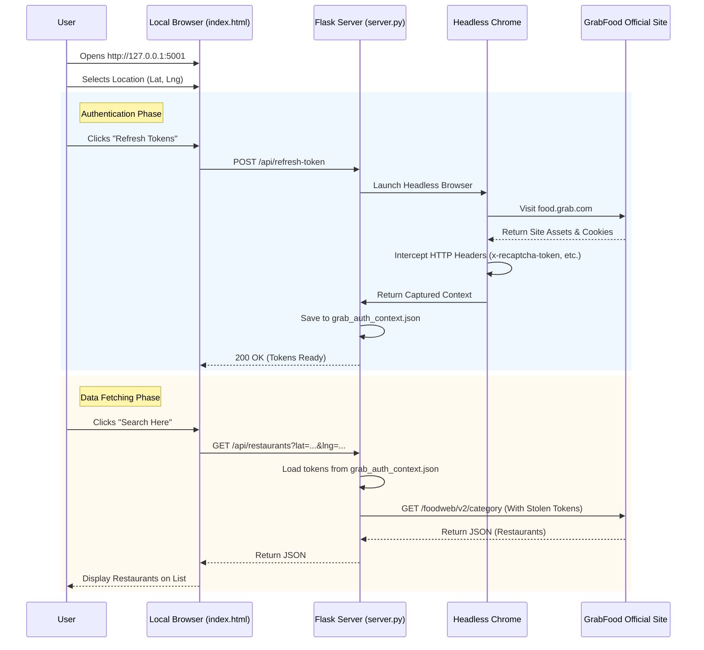

# GrabFood API Wrapper & Explorer

A Python-based API wrapper and explorer for GrabFood. This project reverse-engineers the GrabFood web API to allow searching for nearby restaurants using latitude and longitude coordinates.

## ❓ Why?

GrabFood **does not provide a public API** for developers. This makes it difficult to build custom integrations, data analysis tools, or alternative frontends. This project works around these limitations by reverse-engineering the web client's behavior, allowing you to programmatically search for restaurants and data without official support.

it includes:
1.  **Selenium Auth Service**: Captures necessary authentication tokens (cookies, headers) by automating a headless Chrome browser.
2.  **API Client**: A Python class (`GrabFoodClient`) to interact with GrabFood's internal APIs.
3.  **Flask Server**: A lightweight API server (`/api/restaurants`).
4.  **Frontend Explorer**: A simple `index.html` map interface to pick locations and view restaurants.

## 🚀 Features

- **Automated Token Capture**: Bypasses bot detection to retrieve session tokens using Selenium.
- **Restaurant Search**: Fetches nearby restaurants via the **Guest Category Endpoint** (`guest/v2/category`) to avoid strict `x-recaptcha-token` requirements.
- **Local Filtering**: Implements keyword filtering (e.g., "Pizza") on the client-side (Python) since the guest endpoint only lists categories.
- **Map Interface**: Interactive Leaflet.js map to test different coordinates and visualize data.

## 📡 API Reference

The Flask server exposes a simplified endpoint to access GrabFood data.

### `GET /api/restaurants`

Search for restaurants near a specific location.

**Parameters:**
- `lat` (float): Latitude of the location.
- `lng` (float): Longitude of the location.
- `keyword` (string, optional): Search keyword to filter results (e.g., "pizza", "kfc"). Defaults to "food".

**Response:**
Returns a JSON object containing a list of restaurants.

```json
{
  "count": 2,
  "restaurants": [
    {
      "id": "1-C2...",
      "name": "McDonald's - Ipoh",
      "cuisine": ["Burgers", "Fast Food"],
      "rating": 4.8,
      "distance": 1.2,
      "price": 2,  // 1=$ (Cheap), 2=$$ (Moderate), 3=$$$ (Expensive)
      "status": "OPENED",
      "photo": "https://food-cms.grab.com/...",
      "link": "https://food.grab.com/my/en/restaurant/mcdonalds-ipoh-delivery/1-C2..."
    },
    ...
  ]
}
```

## 🛠️ Installation

1.  **Clone the repository**:
    ```bash
    git clone https://github.com/yourusername/grabfood-api-wrapper.git
    cd grabfood-api-wrapper
    ```

2.  **Install Dependencies**:
    ```bash
    pip install -r requirements.txt
    ```
    *Note: Requires Chrome installed on your machine.*

## 🏃 Usage

### 1. Capture Authentication Tokens
First, run the Selenium service to generate `grab_auth_context.json`. This launches a headless browser to "log in" as a guest.

```bash
python3 grab_selenium_service.py
```

### 2. Start the API Server
Run the Flask server to expose the API.

```bash
python3 server.py
```

### 3. Open the Explorer
Open `index.html` in your browser.
1.  Click anywhere on the map to pick a location.
2.  Click **"Search Here"**.
3.  View the list of nearby restaurants!

## 📦 Project Structure

### Core System
- **`server.py`**: The main entry point. Runs a Flask web server (Port 5001) that serves the frontend and proxies requests to Grab.
- **`index.html`**: The frontend user interface. Uses Leaflet.js for the map and fetch API to communicate with `server.py`.
- **`grab_selenium_service.py`**: A background service using Selenium (Headless Chrome). It navigates to the real GrabFood site to capture valid session tokens (`x-recaptcha-token`, etc.) needed to bypass security.
- **`grab_api_client.py`**: A Python class that maps the backend logic to Grab's API endpoints. It uses the captured tokens to make authenticated requests.

### Data & Config
- **`grab_auth_context.json`**: Auto-generated by the Selenium service. Contains the "stolen" headers and cookies.
- **`requirements.txt`**: Python dependencies.

## ⚠️ Disclaimer
This is for educational purposes only. Use responsibly and respect Grab's terms of service.

## 🔄 User Flow

The system works by orchestrating a local frontend, a backend server, and a headless browser:

1.  **Launch**: Run `server.py` to start the Flask web server (Default Port 5001).
2.  **Access**: Open `http://127.0.0.1:5001` in your browser.
3.  **Interaction**:
    *   **Pick Location**: Click on the map to select coordinates.
    *   **Refresh Tokens**: Click the button to launch a background headless browser (Selenium). This browser visits GrabFood, mimics a user, and "steals" the valid authentication tokens (saved to `grab_auth_context.json`).
    *   **Search**: Click "Search Here". The server uses the captured tokens to query Grab's private API and displays the results.

### Sequence Diagram



## 🔧 Troubleshooting

### Deployment: Selenium Exit Code 127
If you see `Service /.../chromedriver unexpectedly exited. Status code was: 127` in your deployment logs (e.g., Railway, Heroku), it usually means **missing shared system libraries** (like `libnss3`, `libgconf`, etc.) or that the Chromium binary cannot be found.

- **Solution**: Ensure your deployment environment installs all required Linux dependencies for Chrome.
- **Reference**: [StackOverflow Discussion on Exit Code 127](https://stackoverflow.com/questions/49323099/webdriverexception-message-service-chromedriver-unexpectedly-exited-status-co)
